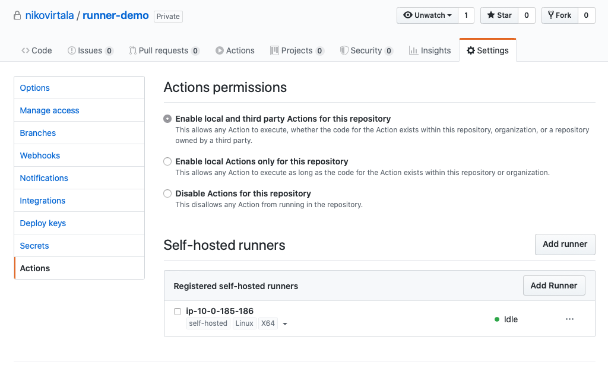

# GitHub Actions runner on AWS Fargate

This repository contains an example how to run self-hosted GitHub Actions runners on AWS Fargate!

## Docker image

Docker image is based on [`ubuntu:rolling`](https://hub.docker.com/_/ubuntu), which is currently pointed to `19.10` / `eoan`.

On top the base image I have installed GitHub Actions Runner based on [About self-hosted runners](https://help.github.com/en/actions/hosting-your-own-runners/about-self-hosted-runners) in GitHub documentation.

## Deployment

The application is deployed to AWS using [AWS Cloud Development Kit (AWS CDK)](https://docs.aws.amazon.com/cdk/latest/guide/home.html).

- Store two parameters `GITHUB_ACCESS_TOKEN` and `GITHUB_ACTIONS_RUNNER_CONTEXT` in to SSM Parameter Store.
  - For repository level runner set `GITHUB_ACTIONS_RUNNER_CONTEXT` value to `https://github.com/<owner>/<repository>`
  - For organization level runner set `GITHUB_ACTIONS_RUNNER_CONTEXT` value to `https://github.com/<organization>`
- Run `cdk synth --profile <your-aws-cli-profile>`
- Run `cdk deploy --profile <your-aws-cli-profile>`
- Wait a little while ...

Now you should be able find your self-hosted runner from repository setting in GitHub:

We can see also from the Fargate Task Logs that the runner is successfully registered:

## Personal Access Token Scopes

Registering self-hosted runner to repository level requires admin access to the repository, and `repo` scope for the access token.

Registering self-hosted runner to Organization level requires admin access to the organization, and `admin:org` scope for the access token.

## Useful commands

- `npm run build` compile typescript to js
- `npm run watch` watch for changes and compile
- `npm run test` perform the jest unit tests
- `cdk deploy` deploy this stack to your default AWS account/region
- `cdk diff` compare deployed stack with current state
- `cdk synth` emits the synthesized CloudFormation template
